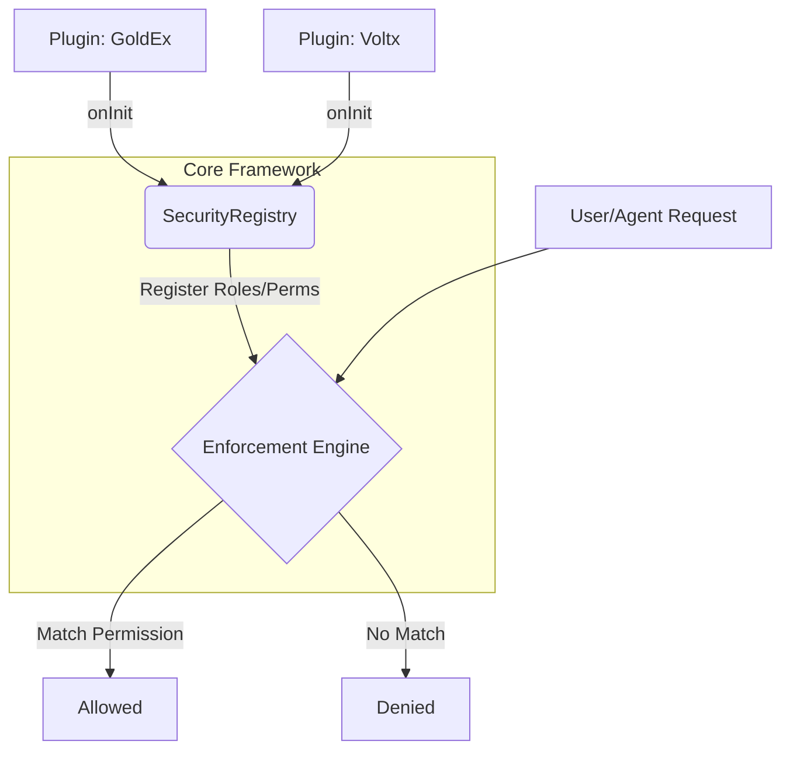

# Safety Guardrails & Policy Enforcement

> **Navigation**: [← Index Hub](../../INDEX.md)

This document defines the safety boundaries and policy enforcement mechanisms that prevent autonomous agents from performing high-risk actions without oversight.

## 🛡️ Guardrail Overview

The system employs a multi-layered safety architecture:

| Guardrail              | Where Implemented           | Trigger                                                                                                                                                                                      |
| :--------------------- | :-------------------------- | :------------------------------------------------------------------------------------------------------------------------------------------------------------------------------------------- |
| **Resource Labeling**  | `core/tools`                | Any write to a protected file (e.g., `.git`, `sst.config.ts`).                                                                                                                               |
| **Safety Engine**      | `core/lib/safety-engine.ts` | Multi-dimensional policy enforcement (Tiers, Rates, Time).                                                                                                                                   |
| **Budget Enforcer**    | `core/lib/metrics`          | Token and cost limits exceeded (80% warning / 100% stop). Supports session-level budgets across multi-turn conversations via `TokenBudgetEnforcer` with DynamoDB persistence for durability. |
| **Recursion Guard**    | `core/handlers/events.ts`   | Prevents infinite loops (Depth > 15).                                                                                                                                                        |
| **Human-in-the-Loop**  | `AgentExecutor`             | Pauses execution for sensitive tools (e.g., `deleteDatabase`).                                                                                                                               |
| **Context Compaction** | `core/lib/context.ts`       | Prevents context overflow during long autonomous missions.                                                                                                                                   |

---

## ⚖️ Agent Trust & Calibration

The Scales silo ensures that the system accurately rewards success and penalizes failure through semantic evaluation.

### 1. LLM-as-a-Judge

The system uses a high-trust persona (the Judge) to semantically evaluate agent outputs based on quality, accuracy, and security adherence.

- **Scoring**: A numerical quality score (0-10) is assigned to each completed task, which weights the subsequent trust bump.

### 2. Trust Calibration Loop

Trust scores are dynamically updated via the **Atomic Field Pattern** in DynamoDB to prevent race conditions:

- **Success Bumps**: Weighted by the Judge's quality score.
- **Failure Penalties**: SLO breaches, QA failures, or anomalies detected result in immediate trust decay.
- **Anomaly Feedback**: Batched anomalies from the `DegradationDetector` are processed into trust penalties.
- **Atomic Clamping**: Batched increments are protected by conditional updates that enforce `MIN_SCORE` (0) and `MAX_SCORE` (100) boundaries, preventing reputation corruption (Audit Finding 2026-05-17).
- **Version-Conditional Telemetry**: Latency rollups use `invocationCount` as a monotonic version marker to prevent data loss during concurrent percentile calculations (p50/p95/p99).
- **Idempotency Guard**: Maintenance tasks (e.g. daily decay) utilize `lastDecayedAt` and `lastAnomalyCalibrationAt` timestamps with atomic conditional updates to prevent double-penalization in concurrent scenarios.

### 3. Quality-Weighted Trust Formulas

The system applies a non-linear scaling to trust adjustments based on task quality (0-10):

#### Failure Penalty (Decay)

Multiplies the base penalty by a weight in the range **[0.5x, 1.5x]**:

- **Quality 0**: 1.5x penalty (Major failure)
- **Quality 10**: 0.5x penalty (Minor/Expected edge case)
- `multiplier = Math.min(1.5, Math.max(0.5, (10 - qualityScore) / 5 + 0.5))`

#### Success Bump (Growth)

Multiplies the base bump by a weight in the range **[0.0x, 2.0x]**:

- **Quality 0**: 0.0x bump (Low value)
- **Quality 5**: 1.0x bump (Standard)
- **Quality 10**: 2.0x bump (Exceptional)
- `multiplier = Math.min(2, Math.max(0, qualityScore * 0.2))`

### 4. Permission Escalation (SC-3.2)

High-trust agents can bypass manual approval gates for non-critical actions to accelerate system evolution.

| Trust Score | Tier    | Escalation Level                                                              |
| :---------- | :------ | :---------------------------------------------------------------------------- |
| **>= 85**   | `local` | Full Auto: All standard tool and deployment gates are automatically bypassed. |
| **>= 90**   | `prod`  | Level 2: Standard Class B actions (file writes, etc.) are auto-approved.      |
| **>= 95**   | `prod`  | Principle 9: Class C actions (IAM, Infrastructure) are auto-promoted.         |

---

## 🚦 Binary Safety Tiers

Agents operate under different trust levels, defining which actions require explicit human approval. Serverless Claw uses a trunk-based development model with two primary tiers:

| Tier        | Description                           |    Deployments    |  Shell Commands   |     MCP Tools     |
| :---------- | :------------------------------------ | :---------------: | :---------------: | :---------------: |
| **`local`** | Local development/testing environment |   Auto-Approved   |   Auto-Approved   |   Auto-Approved   |
| **`prod`**  | Production environment (default)      | Approval Required | Approval Required | Approval Required |

> [!NOTE]
> The default tier is `prod` to ensure all production changes undergo human review. The `local` tier is used for development and testing where autonomous execution is safe.

### Tier Selection

- **LOCAL**: Used for development, testing, and CI/CD pipelines
- **PROD**: Used for production deployments and user-facing interactions

The safety tier is configured per agent in `core/lib/backbone.ts` via the `safetyTier` property.

---

## 🧠 Deep Cognitive Health

The system monitors its own "state of mind" to detect degradation or hallucination trends.

- **Completion Rate**: Tracks the ratio of successful vs. failed missions.
- **Reasoning Coherence**: Agents score each other's reasoning quality.
- **Anomaly Detection**: Triggers alerts if the failure rate spikes or token efficiency drops. Thresholds for loops, latency, and frequency are **dynamically resolved** based on the agent's `SafetyTier` (LOCAL vs. PROD) via the `SafetyConfigManager`.

---

## 🖇️ Resource Protection

Writes to the following resources are blocked by default and require **Manual Approval**:

- `sst.config.ts` (Stack definition)
- `infra/**` (Infrastructure resources)
- `core/tools/index.ts` (Safety gate implementation)
- `.git/**` (Version control)

---

## 🏢 Organizational RBAC (Phase 15: Policy as Plugin)

Serverless Claw implements a non-bypassable, **extensible Role-Based Access Control (RBAC)** layer. While the framework provides a "Canonical Core" of roles, it is designed to be extended by domain-specific plugins.

### RBAC Architecture (Policy as Plugin)



### 1. User Roles (Framework Defaults)

| Role       | Level | Description                                                                  |
| :--------- | :---: | :--------------------------------------------------------------------------- |
| **OWNER**  |   4   | Full system control. Can promote builds, change IAM, and delete workspaces.  |
| **ADMIN**  |   3   | Administrative access. Can manage agents, members, and most Class C actions. |
| **MEMBER** |   2   | Standard access. Can interact with agents and perform Class B tool tasks.    |
| **VIEWER** |   1   | Read-only access. Can view dashboard and traces, but cannot trigger agents.  |

### 2. Custom Role Extension

Plugins can register new roles (e.g., `trader`, `OPERATOR`) or add granular permissions to existing roles using the `SecurityRegistry` on plugin initialization. For example, the GoldEx plugin registers:

```typescript
SecurityRegistry.registerRolePermissions('trader', [
  Permission.AGENT_VIEW,
  Permission.AGENT_INVOKE,
  Permission.TASK_VIEW,
  Permission.DASHBOARD_VIEW,
  Permission.ACTION_FINANCIAL,
  'goldex:trade_execute',
  'goldex:risk_override',
]);
```

> [!IMPORTANT]
> The `trader` role explicitly lacks `Permission.TRACE_VIEW` and is blocked from observing full backend execution traces (`/trace` and `/trace/[id]` paths).

### 3. Role-Gated Action Classes

RBAC rules are enforced as **Hard Security Blocks**:

- **Class C (Infrastructural)**: Restricted to roles with `ACTION_INFRA` or `MISSION_COMMAND` (Default: OWNER/ADMIN).
- **Class B (Agentic)**: Restricted to roles with `AGENT_INVOKE` or `TASK_CREATE` (Default: non-VIEWER).
- **Class D (Hard Block)**: Permanently blocked for **ALL ROLES**, protecting core system integrity.

### 3. Identity Propagation

The user's role is captured at the entry point (Dashboard/Webhook) and **threaded through the asynchronous event bus**. Every agent in a multi-turn swarm knows the original requester's authority, ensuring that sub-tasks cannot be used to escalate privileges.

---

## 🔄 Proactive Evolution (Class C Actions)

Highly sensitive changes, such as IAM modifications or memory retention policy shifts, are classified as **Class C**. By default, these are never executed immediately but are scheduled with a **1-hour cooling period** for manual audit.

**Exception (Principle 9):** If an agent has earned a `TrustScore >= 95` and is operating in `AUTO` mode, the system autonomously promotes the Class C action. In this scenario, the action executes immediately and the 1-hour HITL scheduling queue is bypassed.

---

## 💰 Token Budget Enforcement

The `TokenBudgetEnforcer` is a non-bypassable safety layer designed to prevent runaway costs from stuck agents or infinite reasoning loops.

### 1. Cost Tracking & Estimation

The enforcer tracks both token usage (input/output) and estimated USD cost based on configurable rates. It persists session state to DynamoDB, allowing it to maintain budget awareness across cold starts and multi-turn interactions.

### 2. Enforcement Thresholds

- **Session Budget**: A hard limit on the total cost/tokens for a single session (e.g., $5.00).
- **Agent Budget**: A per-call limit to prevent extremely expensive individual requests (e.g., $2.00).
- **Velocity Detection**: Triggers warnings at 25%, 50%, and 75% budget consumption to provide early visibility into high-spend sessions.

### 3. Fail-Closed Reliability

If the enforcer cannot verify session history (e.g., DynamoDB outage), it defaults to a **Fail-Closed** state, blocking further agent execution to ensure no unrecorded costs are incurred.

---

## 📦 Storage & Retention (Stateless Core)

To ensure high-performance auditability without polluting persistent configuration state, all safety telemetry is persisted in the **MemoryTable** with Time-to-Live (TTL) policies:

| Data Type                  | Prefix                                   | TTL         | Purpose                                            |
| :------------------------- | :--------------------------------------- | :---------- | :------------------------------------------------- |
| **Safety Violations**      | `SAFETY#VIOLATION#<agentId>`             | **30 Days** | Audit trail for blocked or approval-gated actions. |
| **Blast Radius (Class C)** | `SAFETY#BLAST_RADIUS#<agentId>:<action>` | **1 Hour**  | Enforces frequency limits for sensitive changes.   |

This storage strategy adheres to **Principle 1 (Stateless Core)** by externalizing all transient operational state to a TTL-aware storage layer, ensuring the system remains lean and automatically self-cleanses.

---

## 📡 Related Documentation

- **[RESILIENCE.md](../system/RESILIENCE.md)**: Dead Man's Switch, Self-healing, and persistent Circuit Breakers.

### Distributed Circuit Breakers & Jitter

To prevent "Thundering Herd" scenarios in globally distributed agent swarms, the circuit breaker implements **Exponential Backoff with Jitter**:

- **Retry Logic**: When a service is degraded, retries are delayed based on `2^retryCount * baseDelay`.
- **Jitter**: A random jitter (up to 2x base delay) is added to ensure concurrent agents don't retry at the exact same millisecond, which could lead to secondary outages.
- **[SWARM.md](./SWARM.md)**: Recursive task safety and depth limits.
- **[STANDARDS.md](../governance/STANDARDS.md)**: Quality gates and audit standards.
